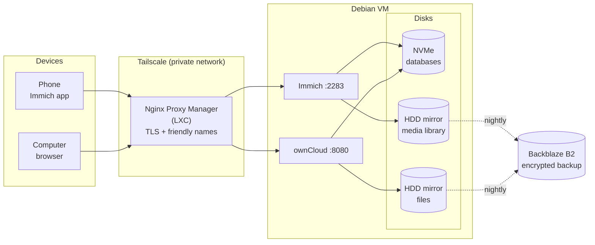

# shiro-drive — home photo & file server

Google Photos and Google Drive replaced with your own hardware: **Immich**
for photos, **ownCloud** for files, access only over a private network, three
independent layers of backup.

Runs on a virtual machine under Proxmox. Nothing is exposed to the internet.

---

## What's where

| Service | Address | Purpose |
|---|---|---|
| Immich | `https://immich.citadel-home.xyz` | photos and video, face recognition, search |
| ownCloud | `https://owncloud.citadel-home.xyz` | files, sync, sharing |

Fallback addresses in case the reverse proxy goes down — via the VM's name
in Tailscale (current value in [ENVIRONMENT.md](ENVIRONMENT.md), changes on
a rebuild):

| Service | Fallback address |
|---|---|
| Immich | `https://<tailscale-hostname>` |
| ownCloud | `https://<tailscale-hostname>:8443` |

Both paths lead to the same service. The second one keeps working even if
Nginx Proxy Manager is down or misconfigured.

---

## How it's built



Full breakdown in [docs/architecture.md](docs/architecture.md). VM/LXC
numbers aren't shown here on purpose — see
[ENVIRONMENT.md](ENVIRONMENT.md) for how to look them up.

---

## Documentation

| File | About |
|---|---|
| [ENVIRONMENT.md](ENVIRONMENT.md) | current IP, domain, VM numbers — the one thing to update after a rebuild |
| [CONTRIBUTING.md](CONTRIBUTING.md) | the pattern to follow when adding a third service alongside Immich/ownCloud |
| [docs/architecture.md](docs/architecture.md) | how the system's built, request path, disk layout |
| [docs/backups.md](docs/backups.md) | the three backup layers, schedule, **how to restore** |
| [docs/troubleshooting.md](docs/troubleshooting.md) | what to do when something breaks |
| [docs/setup-guide.md](docs/setup-guide.md) | build the same thing from scratch |
| [CLAUDE.md](CLAUDE.md) | context for an AI assistant |

Service configuration: [immich/](immich/) and [owncloud/](owncloud/).
Maintenance scripts: [scripts/](scripts/), systemd units: [systemd/](systemd/).
Cross-host alerting lives in a separate top-level service —
[`telegram/`](../telegram/README.md).

---

## Hardware

```
Proxmox VE
├── NVMe        ─ system, databases
└── ZFS mirror  ─ two drives
    └── one Debian VM
        ├── system disk    on NVMe   → system, Docker, databases
        ├── data disk      on the mirror → /mnt/hdd/immich
        └── data disk      on the mirror → /mnt/hdd/owncloud
```

Databases live on NVMe on purpose: Immich's search, face recognition, and
vector index are miserably slow on a spinning disk. Only large sequential
reads go to the mirror.

Exact specs (RAM, core count, disk sizes) aren't published here — see
[ENVIRONMENT.md](ENVIRONMENT.md) for how to check them on the machine
itself.

---

## Nightly cycle

```
01:00  Google Drive → server         (rclone, new files only — only when enabled)
02:00  Immich database dump          (built into Immich)
02:30  ownCloud database dump        (mariadb-dump)
03:00  everything → Backblaze B2     (restic, client-side encryption)
04:00  VM system snapshot            (vzdump on the Proxmox host)
05:00  repository integrity check    (Sundays)
```

Not every job is necessarily enabled at all times (Google Drive sync in
particular is opt-in) — check with `systemctl list-timers` rather than
trusting this table. The order matters when jobs *are* running: a file that
lands from Drive at night is in the cloud that same night, and the backup
always picks up fresh dumps, not yesterday's.

---

## Security

- Services listen **only** on `127.0.0.1` and the Tailscale address. Nothing is exposed to the LAN.
- Access is exclusively over the private Tailscale network. Unreachable from the public internet.
- Certificates are real Let's Encrypt ones, so mobile apps don't complain.
- Secrets live in files with `600` permissions, kept out of the repository (see `.gitignore`).

---

## Current state

Don't trust this section — verify live instead:

```bash
docker ps --format "table {{.Names}}\t{{.Status}}"
systemctl list-timers --no-pager
```

What's been verified to work at some point: both services, both access
routes, auto-start after a reboot, restore from the cloud backup (checked
against checksums), a VM snapshot (archive integrity confirmed). Whether
that's still true right now is exactly what the commands above tell you.
