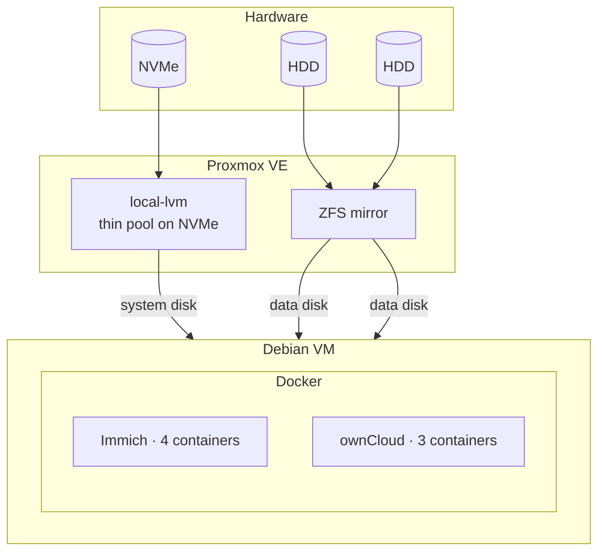
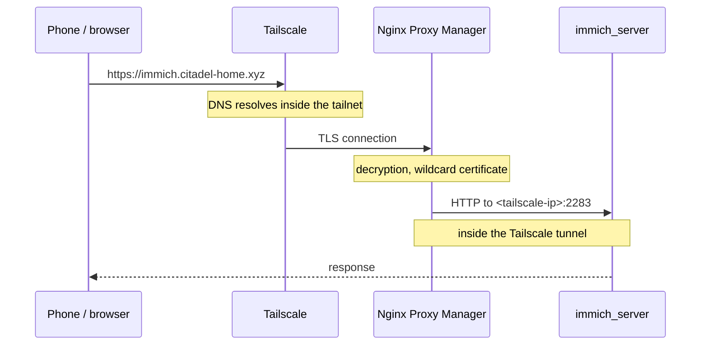
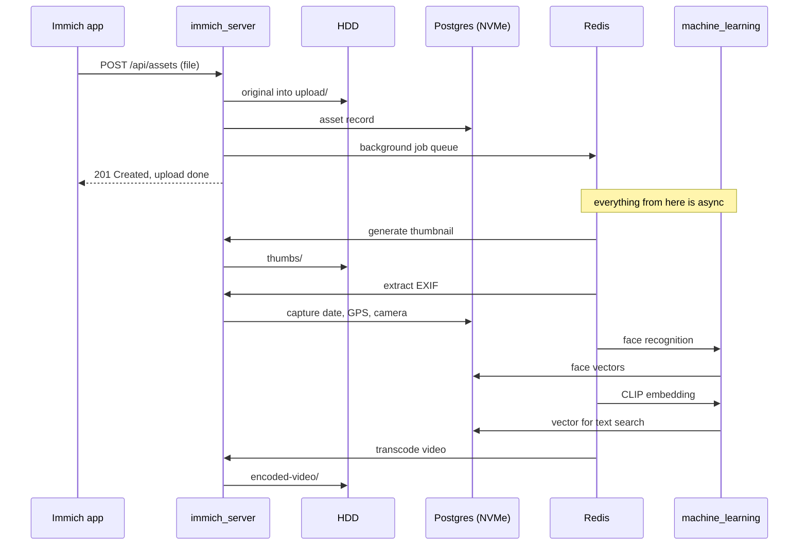

# Architecture

How the system is built on the inside: the request path, data layout, what
happens when a file gets uploaded.

---

## Layers



Node names, VM/LXC numbers, and exact sizes are deliberately left off this
diagram — it's the shape of the system, not its specs. Current values (and
how to look them up) are in [ENVIRONMENT.md](../ENVIRONMENT.md).

**Why a mirror.** Two disks written synchronously, byte-for-byte identical.
One dies, the other keeps going. But a mirror **doesn't remember the past**:
a deleted file vanishes from both disks instantly. It protects against
hardware death and nothing else — that's what [backups](backups.md) are for.

---

## Request path



`<tailscale-ip>` — current value in [ENVIRONMENT.md](../ENVIRONMENT.md).

Key detail: **traffic between the proxy and the service is plain HTTP**, but
inside the Tailscale tunnel, which is already encrypted on its own. A
separate TLS layer there would be redundant.

### Fallback route

Besides the proxy, each service also has a direct address via
`tailscale serve`:

```
https://<tailscale-hostname>        → Immich
https://<tailscale-hostname>:8443   → ownCloud
```

Current `<tailscale-hostname>` — [ENVIRONMENT.md](../ENVIRONMENT.md). Tailscale
itself issues the certificates for these. This path **doesn't depend on
Nginx Proxy Manager**: if the proxy is down, moved, or broken by a config
edit, the services stay reachable.

### Port map

| Listens on | What | Reachable from |
|---|---|---|
| `127.0.0.1:2283` | Immich | inside the VM only |
| `<tailscale-ip>:2283` | Immich | tailnet — for the proxy |
| `127.0.0.1:8080` | ownCloud | inside the VM only |
| `<tailscale-ip>:8080` | ownCloud | tailnet — for the proxy |
| `<tailscale-ip>:443` | `tailscale serve` → Immich | tailnet |
| `<tailscale-ip>:8443` | `tailscale serve` → ownCloud | tailnet |
| `0.0.0.0:22` | SSH | LAN and tailnet |

`<tailscale-ip>` — [ENVIRONMENT.md](../ENVIRONMENT.md).

**Nothing is exposed to the LAN except SSH.** Binding to specific addresses
instead of `0.0.0.0` is deliberate.

---

## Data layout

One rule: **small and fast on NVMe, bulky and sequential on HDD.**

```
NVMe (fast, 100 GB)                  HDD mirror (2 × 1 TB)

~/Citadel/drive/                     /mnt/hdd/immich/
├── immich/                          ├── upload/<uuid>/     originals
│   ├── docker-compose.yml           ├── thumbs/<uuid>/     thumbnails
│   ├── .env            (600)        ├── encoded-video/     transcodes
│   └── postgres/       database     ├── profile/           avatars
├── owncloud/                        └── backups/           db dumps
│   ├── docker-compose.yml
│   ├── .env            (600)        /mnt/hdd/owncloud/
│   ├── mysql/          database     ├── files/<user>/files/    files
│   └── redis/                       └── backups/               db dumps
└── docs/  scripts/  systemd/

/var/lib/docker/                     container images
```

**Why databases sit on NVMe.** Immich's Postgres handles text search, the
face-recognition vector index, and face relationships — thousands of small
random reads. On a spinning disk each one costs roughly 10 ms just for the
head to seek. That's exactly the difference between "search in a second" and
"search in a minute."

**Why media sits on HDD.** A photo is read whole, in one sequential chunk.
Seek time doesn't matter; capacity and cost per terabyte do.

**Mounting by UUID.** `/etc/fstab` identifies partitions by filesystem UUID,
not as `/dev/sdb1`. Device letters shift when the VM's disk configuration
changes; a UUID is permanently tied to the filesystem itself.

The **`nofail`** flag is mandatory: without it, a missing disk drops the boot
into a rescue console, and fixing that means going through the Proxmox
console instead of SSH.

**Formatting with `-m 1`.** ext4 reserves 5% for root by default. On two
terabyte-class disks that's 100 GB sitting idle. Data disks don't need that
reserve, so it's set to 1%.

---

## What happens when a photo gets uploaded



**The upload finishes at step four.** Everything past that is background
processing running at its own pace. That's why a photo shows up in the feed
right away, while faces and text search catch up later.

That background processing is what pins all 4 cores during a bulk import.
Progress is visible under **Administration → Jobs**.

### Uploading a file to ownCloud

Simpler: the client drops the file over WebDAV, `owncloud_server` writes it
to `/mnt/data/files/<user>/files/`, records it in the `filecache` table in
MariaDB, Redis caches the metadata. No background processing.

**Important consequence:** ownCloud only knows about files it put there
itself. A file copied into its data directory from outside — say, by the
Google Drive sync — **won't show up in the UI** until you run:

```bash
docker exec -u www-data owncloud_server occ files:scan --path=/myxa3k/files
```

Which is exactly why the Google Drive sync script triggers a scan at the end
of its run.

---

## Services

### Immich

| Container | Role |
|---|---|
| `immich_server` | API, web UI, upload handling |
| `immich_machine_learning` | face recognition, text search |
| `immich_postgres` | database with the vector-search extension |
| `immich_redis` | background job queue (Valkey) |

### ownCloud

| Container | Role |
|---|---|
| `owncloud_server` | PHP app, WebDAV |
| `owncloud_mariadb` | database: users, permissions, file index |
| `owncloud_redis` | metadata cache and locking |

The stacks are **independent**: two separate Docker Compose projects with
their own networks. Upgrading Immich doesn't touch ownCloud.

Versions are **pinned** to specific tags in each `docker-compose.yml`, the
Postgres image by SHA digest — not published here, since they change on
every upgrade and a public doc naming exact running versions is free
reconnaissance for nothing gained. No `latest`: an upgrade should be a
deliberate decision, not a surprise after a restart.

---

## What survives a reboot

| Mechanism | How it's ensured |
|---|---|
| Disk mounts | `/etc/fstab` by UUID + `nofail` |
| Containers | `restart: always` on all seven |
| Docker after Tailscale | drop-in `After=tailscaled.service` |
| Binding to the tailnet address | `net.ipv4.ip_nonlocal_bind=1` |
| HTTPS forwarding | `tailscale serve` config is saved to disk |
| Scheduled jobs | five systemd timers, all `enabled` |

**`ip_nonlocal_bind`** resolves a boot-time race: Docker can start before
Tailscale brings its interface up. Without this flag, a container fails with
`cannot assign requested address`.

Confirmed in practice: after a cold reboot, everything came back up on its
own, no manual steps needed.
