# Backups and restore

Three layers, each covering a different class of disaster. None replaces the
others.

---

## Why three layers

| Layer | Protects against | Does NOT protect against |
|---|---|---|
| **ZFS mirror** | one disk dying | deletion, corruption, operator error |
| **vzdump** VM snapshot | VM deletion, a broken system, a bad upgrade | the whole server or pool dying |
| **restic → Backblaze B2** | server death, fire, theft, ransomware | — |

A mirror doesn't protect against `qmdestroy` (or any other VM deletion): you
can remove the VM, both sides of the mirror stay perfectly healthy, and the
data is simply gone — because a command deleted it, not because hardware
failed. A mirror's integrity check won't help here either: it checks disks,
not intent.

A daily vzdump isn't a guarantee on its own either: it can write archives
into storage physically smaller than the archive (say, the root partition),
and then fail silently every night, leaving only logs saying "an attempt was
made" — with zero restorable archives to show for it.

**A backup nobody has ever restored from is not a backup.**

---

## Nightly cycle

```mermaid
gantt
    dateFormat HH:mm
    axisFormat %H:%M
    title Nightly jobs
    section Collect
    Google Drive to server        :01:00, 60m
    Immich database dump          :02:00, 20m
    ownCloud database dump        :02:30, 5m
    section Ship
    restic to Backblaze B2        :03:00, 45m
    VM snapshot (vzdump)          :04:00, 30m
```



The order isn't arbitrary:

1. **01:00** — new files from Google Drive land on the server
2. **02:00 / 02:30** — databases get dumped into consistent snapshots
3. **03:00** — restic ships both the files and the fresh dumps to the cloud
4. **04:00** — Proxmox snapshots the VM's system disk

A file that lands at night is in the cloud that same night. The backup
always picks up dumps made an hour earlier, never yesterday's.

Sundays at **05:00** — a repository integrity check, re-reading a sample 5%
of the data.

---

## Layer 1: database dumps

### Why they're needed

Photos are stored **in two places at once**: the files themselves on disk,
and everything about them in Postgres — who owns it, when it was taken,
which album it's in, who's recognized in it, coordinates, the search index.

Without the database, what's left is a pile of files named things like
`a3f9c2e1-4b8d.jpg`, scattered across directories. Technically intact,
practically a junk heap.

### Why you can't just copy the database files

A database writes to disk constantly. A "live" copy is a snapshot taken
mid-operation: part written, part not. That kind of copy usually just
refuses to start.

A **dump** solves this: the database exports its own contents into a set of
SQL statements consistent at one specific moment, which restores cleanly
from scratch.

### How it's set up

| Database | By | When | Where | Retained |
|---|---|---|---|---|
| Immich (Postgres) | built into Immich | 02:00 | `/mnt/hdd/immich/backups/` | Immich's own default |
| ownCloud (MariaDB) | `owncloud-db-backup.sh` | 02:30 | `/mnt/hdd/owncloud/backups/` | last 7 |

The ownCloud script uses `--single-transaction` — a consistent snapshot
without locking the tables, so the service keeps serving.

A dump is written to a temp file first and only renamed to its final name on
success. A dump that dies partway stays as `.partial` and **won't look like
a valid backup** — the exact trap that once produced a nightly job with
zero restorable archives to show for it.

---

## Layer 2: VM snapshot (vzdump)

Configured **on the Proxmox host**, not inside the VM.

```
Storage      pve-backups  (dataset data-hdd-pool/backups)
Schedule     daily at 04:00
Mode         Snapshot, ZSTD compression
Retention    last 7 + last 3 monthly
```

**Data disks are excluded** (`scsi1` and `scsi2` are marked `backup=no`).
Only the system disk goes into the archive: Debian, Docker, the stack's
config. About 6 GB instead of 80, and no duplicating what's already in the
cloud.

Division of labor: **vzdump holds the system, restic holds the data.**

Thanks to `qemu-guest-agent` being installed, the filesystem freezes for the
duration of the snapshot — the archive is consistent, not caught mid-write.

---

## Layer 3: restic to Backblaze B2

### What goes into the backup

```
/mnt/hdd/immich/upload/<uuid>/        photo and video originals
/mnt/hdd/immich/profile/<uuid>/       avatar
/mnt/hdd/immich/backups/              nightly Postgres dumps
/mnt/hdd/owncloud/files/<user>/files/ user files
/mnt/hdd/owncloud/backups/            nightly MariaDB dumps
~/Citadel/drive/                      compose files and .env
```

The last one weighs kilobytes, but it's what lets the whole stack come back
up on a new machine with one command. Without it the config would have to be
rebuilt from memory.

### What's deliberately excluded

| Path | Why |
|---|---|
| `thumbs/`, `encoded-video/` | Immich regenerates these from originals |
| `files_trashbin/`, `cache/`, `uploads/` | trash and transient files |
| `stack/*/postgres`, `stack/*/mysql`, `stack/*/redis` | **live database files** — a torn copy, and dumps already cover this |
| `lost+found/` | ext4 housekeeping directory |

No point paying to store what regenerates itself automatically. Excluding
the live database directories matters more: having them in the archive at
all would only invite restoring the wrong thing.

### How profiles work

Each person gets their own repository, their own storage, and their own
encryption key:

```
/etc/restic/<profile>.env    repository, cloud keys, encryption password
/etc/restic/<profile>.conf   whose data belongs to this profile
```

Run with `restic-backup.sh <profile>`. Right now only the `personal` profile
exists. Adding a second person means a new `.env` and `.conf` — the script
and timer are shared.

Repositories know nothing about each other, keys differ, bills are separate.

### Snapshot retention

```
7 daily · 4 weekly · 6 monthly
```

Thanks to deduplication this barely adds to the total size: identical blocks
are stored once, no matter how many snapshots reference them.

### Encryption

Data is encrypted **on the server, before it's sent**. Backblaze only ever
sees encrypted blocks — no filenames, no content, no directory structure.

> ### The repository password is unrecoverable
>
> Losing it means nobody can decrypt the data: not Backblaze, not restic's
> developers, not whoever set this system up.
>
> The password must be stored **off this server**. Details below.

---

## Emergency card

Backup keys shouldn't live inside the very thing the backup protects.
Otherwise you get a loop: the server dies, and there's nothing left to open
the copy with.

The minimum set that must exist **off the server** — on paper, in a cloud
password manager, or in a KeePass file on Google Drive:

```
Backblaze B2     account email + password
restic           b2:<bucket>:restic
                 REPOSITORY PASSWORD
Password manager  master password
Email            mailbox password
```

The B2 access keys (`keyID` / `applicationKey`) don't need to be written
down: as long as you still have account access, new ones take a minute to
create. The restic password can't be recreated at all.

---

## Restoring

All commands run on the server as root. Load the repository settings first:

```bash
set -a; . /etc/restic/personal.env; set +a
export RESTIC_CACHE_DIR=/var/cache/restic
```

### See what's there

```bash
restic snapshots
```

```bash
restic ls latest | head -50
```

### Find a specific file

```bash
restic find "IMG_1234*"
```

### Restore individual files

Always into a separate directory, never straight over live data:

```bash
restic restore latest --target /tmp/restore --include /mnt/hdd/owncloud/files/myxa3k/files/Documents
```

Check it, then move it into place.

### Restore the entire Immich library

```bash
restic restore latest --target /tmp/restore --include /mnt/hdd/immich/upload
```

```bash
docker compose -f ~/Citadel/drive/immich/docker-compose.yml down
```

```bash
rsync -a /tmp/restore/mnt/hdd/immich/upload/ /mnt/hdd/immich/upload/
```

Then restore the database from a dump (below) and bring the stack back up.

### Restore the Immich database from a dump

Stop the server first, leaving the database running — otherwise the dump
lands under a live application:

```bash
cd ~/Citadel/drive/immich && docker compose stop immich-server immich-machine-learning
```

```bash
gunzip -c /mnt/hdd/immich/backups/immich-db-backup-<date>.sql.gz \
  | docker exec -i immich_postgres psql -U postgres -d immich
```

### Restore the ownCloud database from a dump

Same idea, stop the app: `docker compose stop owncloud`.

```bash
gunzip -c /mnt/hdd/owncloud/backups/owncloud-db-backup-<date>.sql.gz \
  | docker exec -i owncloud_mariadb mariadb -u root -p"$DB_ROOT_PASSWORD" owncloud
```

### Full restore on a new machine

> The procedure below has been **verified in practice**: on a clean virtual
> machine, a working Immich library was brought up from the cloud backup —
> dates, albums, and geotags intact, files checksum-matched against the
> originals. The steps below aren't theory; they're real obstacles that stop
> a restore cold even when the backup itself is perfectly sound.

**What you need in hand:** the emergency card with the repository password
and cloud storage access. Nothing else.

#### 1. A user with the same numeric ID

**This is the main trap.** restic restores file ownership by **numeric
UID**, not by name. If the user on the new machine gets a different UID, the
restored home directory ends up owned by a stranger — and you lose SSH
access, while the services can't read their own data.

You can check the old system's UID straight from the backup, before
unpacking anything:

```bash
restic ls latest /home | head -5
```

Create the user with the matching ID:

```bash
sudo useradd -m -u 1000 -s /bin/bash -G sudo shiro
```

If the machine already exists with a different UID, no disaster — just fix
ownership after unpacking:

```bash
sudo chown -R shiro:shiro /home/shiro
```

#### 2. A partition for data and images

After resizing a disk in Proxmox, the partition **doesn't grow on its own**.
Check:

```bash
lsblk
```

If the root partition is smaller than the disk, and the free space sits
after the swap partition (Debian's installer default layout), the root
partition can't be extended. Carve a separate partition out of the free
space and mount it at `/mnt/hdd`.

Immich's images take up about **8 GB**, which won't fit on a small system
partition. Point Docker at the bigger partition via
`/etc/docker/daemon.json`:

```json
{
  "data-root": "/mnt/hdd/docker",
  "log-driver": "json-file",
  "log-opts": { "max-size": "10m", "max-file": "3" }
}
```

#### 3. Repository access

The cloud storage key from the old server is gone with it — create a new one
in the provider's console, account access is all that takes. The repository
password comes **only from the emergency card** — it can't be recreated.

Create `/etc/restic/personal.env`, mode `600`:

```
RESTIC_REPOSITORY=b2:<bucket>:restic
B2_ACCOUNT_ID=<new keyID>
B2_ACCOUNT_KEY=<new applicationKey>
RESTIC_PASSWORD=<from the emergency card>
```

Check the connection:

```bash
set -a; . /etc/restic/personal.env; set +a
sudo -E restic snapshots
```

#### 4. Unpacking

```bash
sudo -E restic restore latest --target /
```

This brings back the photos, files, database dumps, **and** the
`~/Citadel/drive` directory with its compose files and settings — exactly
why the config lives in the backup.

Fix ownership right after, if the UID didn't match (item 1).

#### 5. The tailnet address

> **On ownCloud specifically:** an edit through `occ config:system:set`
> doesn't survive a container being recreated — the entrypoint rebuilds
> `config.php` from environment variables on every start. Change
> `OWNCLOUD_OVERWRITE_HOST` and `OWNCLOUD_OVERWRITE_CLI_URL` directly in
> `docker-compose.yml`, or after `docker compose up -d --force-recreate` the
> old server's address comes back and the redirect points at an IP with no
> matching certificate.

Ports are bound to this machine's tailnet address, and the new machine has a
**different** one. The address is a variable, so one line per `.env` is all
it takes:

```bash
tailscale ip -4
```

```
TAILSCALE_IP=<new machine's address>
```

Skip this and the containers fail to start with `cannot assign requested
address`.

#### 6. Bringing services up and restoring the databases

```bash
cd ~/Citadel/drive/immich && docker compose up -d
```

Postgres comes up with an empty database. **Stop the server, leave the
database running**, or the dump lands under a live application:

```bash
docker compose stop immich-server immich-machine-learning
```

```bash
gunzip -c /mnt/hdd/immich/backups/<most-recent>.sql.gz \
  | docker exec -i immich_postgres psql -U postgres -d immich -q
```

```bash
docker compose up -d
```

The dump was taken with `--clean`, meaning it includes drop statements and
loads cleanly over the schema the server just created.

Same idea for ownCloud:

```bash
cd ~/Citadel/drive/owncloud && docker compose up -d && docker compose stop owncloud
```

```bash
gunzip -c /mnt/hdd/owncloud/backups/<most-recent>.sql.gz \
  | docker exec -i owncloud_mariadb mariadb -u root -p"$DB_ROOT_PASSWORD" owncloud
```

#### 7. External access

```bash
sudo tailscale up
```

```bash
sudo tailscale serve --bg --https=443 http://127.0.0.1:2283
```

```bash
sudo tailscale serve --bg --https=8443 http://127.0.0.1:8080
```

A reverse proxy, if there was one, gets configured separately — point it at
the new tailnet address.

#### 8. Turn the backups back on

> **If the old server isn't dead, just migrating** (as in this very restore
> drill) — don't enable the timers on the second machine while the old one
> can still write to the same bucket. Both servers would push snapshots
> under the same profile name into one repository, and they'd get mixed
> together. Only enable backups on the new machine once the old one is
> fully shut down or removed.

**Restoring brings back the data and the script files — but doesn't start
them running.** Systemd doesn't pick up units on its own; they have to be
installed and enabled explicitly. Skip this step and you get a server that
looks fine but is once again completely unprotected:

```bash
sudo cp ~/Citadel/drive/scripts/*.sh /usr/local/bin/
sudo cp ~/Citadel/drive/systemd/* /etc/systemd/system/
sudo systemctl daemon-reload
sudo systemctl enable --now owncloud-db-backup.timer restic-backup@personal.timer restic-check@personal.timer health-watch.timer
```

Confirm the timers are actually active, not just present:

```bash
systemctl list-timers | grep -E "restic|owncloud-db|health"
```

Restoring the system without this step recreates exactly what already
happened on this project once: a server that looks healthy with no backups
at all.

#### Verification

```bash
docker exec immich_postgres psql -U postgres -d immich -t -A -c "select count(*) from asset;"
```

The number should match the old server's. Then open Immich and confirm the
feed is sorted by year, not all dumped on one date.

Immich regenerates thumbnails and face recognition on its own — hours of
background work, but the data is already safe by then.

#### How long it takes

```
installing the system and stack     ~1 hour
downloading data from the cloud     depends on volume and bandwidth
restoring the databases             ~15 minutes
rebuilding thumbnails               several hours, in the background
```

Backblaze B2's outbound traffic is free up to three times what's stored, so
the restore itself costs nothing extra.

---

## Monitoring

`health-watch.sh` runs **hourly** and **on every SSH login**. It checks:

- how full all three partitions are (warning at 80%, alert at 90%)
- whether the disks are even mounted
- the health of every container
- **the age of the last successful backup** — alert if older than 48 hours
- Immich users not covered by any backup profile
- whether a reboot is needed after a kernel update

Stays silent when everything's fine. A warning is visible the moment you log
into the server.

Findings also get pushed to Telegram — see
[`notifications.md`](notifications.md) for how `health-watch.sh` sorts them
into categories, and [`telegram/README.md`](../../telegram/README.md) for
the delivery mechanism itself.

The backup-age check exists specifically because a backup that fails
silently is worse than no backup at all: it buys false confidence.

### Who watches the watcher

Everything above only works if `health-watch.sh` itself is still running.
If its timer gets disabled, the script starts crashing, or the VM loses
network entirely, silence looks exactly like "all fine" — no different from
a healthy system. This isn't hypothetical: it's exactly how a broken Google
Drive sync went unnoticed for days before this monitoring existed.

The fix is an external dead-man's-switch: on every unattended run,
`health-watch.sh` pings a URL from `/etc/healthchecks-ping.env`
(unconditionally, regardless of what it found — see
[`healthchecks-ping.env.example`](../healthchecks-ping.env.example)). A
service like [healthchecks.io](https://healthchecks.io) raises its own alert
if that ping doesn't arrive on schedule — independent of whether this
machine, or its own alerting, is even alive to say so. If the file's
missing, this step is a no-op; nothing breaks on a host that hasn't set one
up.

### Checking by hand

```bash
/usr/local/bin/health-watch.sh --verbose
```

```bash
systemctl list-timers "restic-*" "owncloud-db*" "gdrive-*" "health-watch*"
```

---

## Integrity checks

Sundays at 05:00, restic re-reads 5% of the repository's data and verifies
checksums. This catches storage corruption before it's ever needed for real.

A full manual check:

```bash
restic check --read-data
```

Slow, and costs bandwidth — every few months is plenty.
